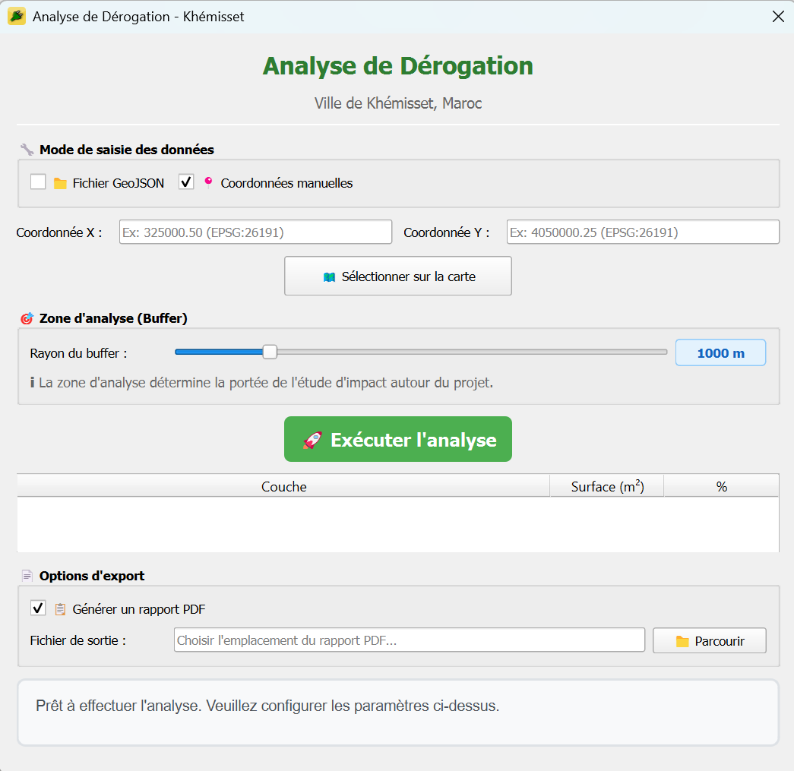
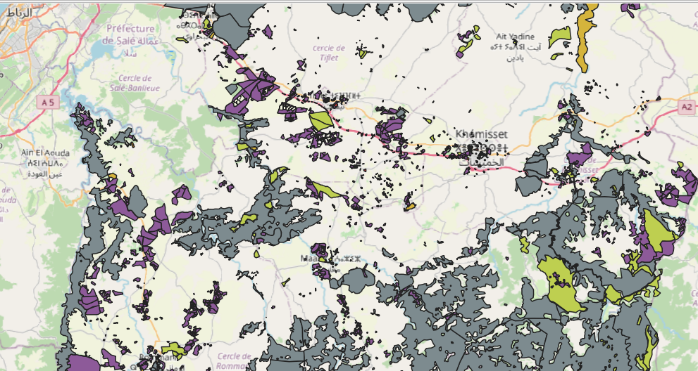
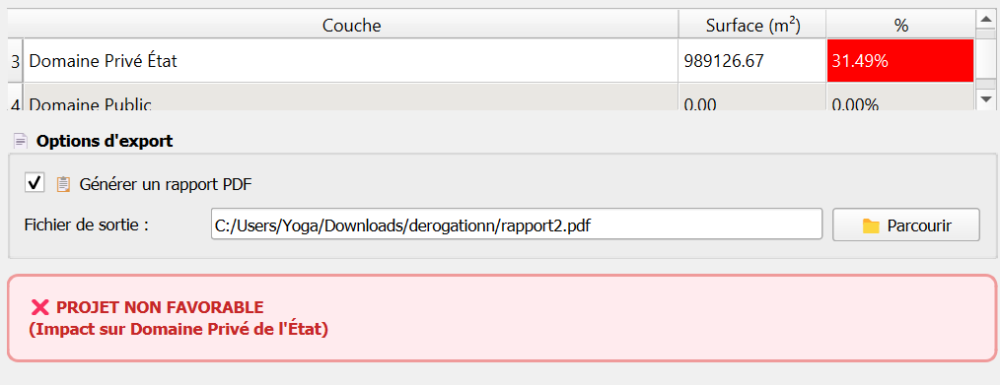
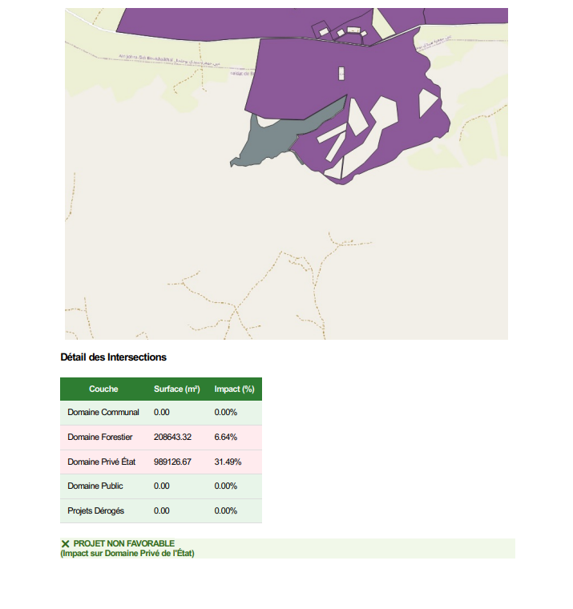

# Gestion Dérogations - QGIS Plugin

A QGIS plugin for analyzing land use derogations in Khémisset, Morocco. This tool helps urban planners assess project impact on various land domains and automate decision-making for construction permits.

## Screenshots

### Main Interface

*Plugin interface showing coordinate input, buffer configuration, and analysis options*

### Map Selection

*Interactive map tool for selecting project location directly on the QGIS canvas*

### Analysis Results

*Detailed results table showing domain intersections with color-coded impact levels*

### Generated Report

*Professional PDF report with map capture and comprehensive analysis*

## Features

- **Spatial Analysis**: Buffer-based intersection analysis with configurable radius (100m - 5000m)
- **Multi-Domain Assessment**: Analyzes impact on:
  - Domaine Communal (Municipal Domain)
  - Domaine Forestier (Forest Domain)
  - Domaine Privé État (State Private Domain)
  - Domaine Public (Public Domain)
  - Existing derogation projects
- **Automated Decision Logic**: 
  - Rejects projects impacting State Private Domain
  - Flags oversaturated zones (>4 derogations)
  - Provides favorable recommendations when criteria are met
- **Interactive Map Selection**: Click directly on the QGIS canvas to define project locations
- **PDF Report Generation**: Professional reports with map captures and detailed analysis tables

## Requirements

- QGIS 3.x
- Python 3.6+
- PyQt5
- Required QGIS layers in EPSG:26191 (UTM Zone 29N):
  - Domaine Communal
  - Domaine Forestier
  - Domaine Privé État
  - Domaine Public
  - Projets Dérogés

## Installation

### Method 1: Manual Installation

1. Download or clone this repository
2. Copy the plugin folder to your QGIS plugins directory:
   - **Windows**: `C:\Users\<YourUser>\AppData\Roaming\QGIS\QGIS3\profiles\default\python\plugins`
   - **macOS**: `~/Library/Application Support/QGIS/QGIS3/profiles/default/python/plugins`
   - **Linux**: `~/.local/share/QGIS/QGIS3/profiles/default/python/plugins`
3. Restart QGIS
4. Enable the plugin in `Plugins > Manage and Install Plugins`

### Method 2: ZIP Installation

1. Download the repository as a ZIP file
2. In QGIS, go to `Plugins > Manage and Install Plugins > Install from ZIP`
3. Select the downloaded ZIP file
4. Click "Install Plugin"

## Configuration

Before using the plugin, update the layer names in `gestion_derogations_dialog.py` to match your QGIS project:

```python
CONFIG = {
    "CRS_PROJECT": "EPSG:26191",
    "LAYERS": {
        "DOMAINE_COMMUNAL": "Your_Communal_Layer_Name",
        "DOMAINE_FORESTIER": "Your_Forest_Layer_Name",
        "DOMIANE_PRIVE_ETAT": "Your_State_Private_Layer_Name",
        "DOMAINE_PUBLIC": "Your_Public_Domain_Layer_Name",
        "Derogation_central_13_avril": "Your_Derogation_Projects_Layer"
    },
    "MAX_DEROGATIONS": 4
}
```

## Usage

### Basic Workflow

1. **Launch the Plugin**
   - Click the toolbar icon or go to `Plugins > Gestion Dérogations > Analyse Dérogation`

2. **Define Project Location**
   - **Option A - Manual Coordinates**: Enter X and Y coordinates in EPSG:26191
   - **Option B - Map Selection**: Click "🗺️ Sélectionner sur la carte" and click on the map

3. **Configure Analysis Zone**
   - Adjust the buffer radius slider (100m - 5000m)
   - The buffer defines the impact assessment area

4. **Execute Analysis**
   - Click "🚀 Exécuter l'analyse"
   - Review results in the table showing surface areas and percentages

5. **Generate Report (Optional)**
   - Check "📋 Générer un rapport PDF"
   - Choose output location
   - PDF includes map capture and detailed analysis

### Decision Criteria

The plugin automatically provides recommendations based on:

- ✅ **FAVORABLE**: No impact on State Private Domain and <4 derogations in zone
- ❌ **NON FAVORABLE**: Impact on State Private Domain OR >4 derogations in zone

### Output Interpretation

| Status | Meaning |
|--------|---------|
| ✅ OK | No significant impact detected |
| ⚠️ IMPACT | Intersection detected (>1 m²) |
| ❌ Non trouvé | Layer not found in project |

## File Structure

```
gestion_derogations/
├── gestion_derogations.py          # Main plugin class
├── gestion_derogations_dialog.py   # Dialog logic and analysis engine
├── Derogation_dialog_base.ui       # Qt Designer UI file
├── metadata.txt                     # Plugin metadata
├── icon.png                         # Plugin icon
└── README.md                        # This file
```

## Development

### Key Classes

- **`DerogationDialog`**: Main UI controller
- **`DerogationAnalysis`**: GIS processing and spatial analysis
- **`ReportGenerator`**: PDF export functionality

### Customization

To modify decision logic, edit the `run_analysis()` method in `gestion_derogations_dialog.py`:

```python
# Example: Change rejection threshold
if derog_count > 10:  # Changed from 4 to 10
    decision = "❌ PROJET NON FAVORABLE"
```

## Troubleshooting

### Common Issues

**"Layer not found" errors**
- Verify layer names in CONFIG match your QGIS project exactly
- Check that all required layers are loaded

**Coordinate system errors**
- Ensure all layers use EPSG:26191
- Verify input coordinates are in the correct CRS

**PDF generation fails**
- Check write permissions for output directory
- Ensure QPrinter is available (requires PyQt5.QtPrintSupport)

**Map tool doesn't activate**
- Make sure a QGIS map canvas is visible
- Check that the dialog has focus

## Contributing

Contributions are welcome! Please:

1. Fork the repository
2. Create a feature branch (`git checkout -b feature/AmazingFeature`)
3. Commit your changes (`git commit -m 'Add some AmazingFeature'`)
4. Push to the branch (`git push origin feature/AmazingFeature`)
5. Open a Pull Request

## Acknowledgments

- QGIS Development Team
- PyQt5 contributors
- Khémisset Municipality

## Version History

- **1.0.0** (Initial Release)
  - Buffer-based spatial analysis
  - Multi-domain impact assessment
  - Interactive map selection
  - PDF report generation
  - Automated decision logic

## Support

For issues, questions, or suggestions, please open an issue on GitHub or contact [your support email].
